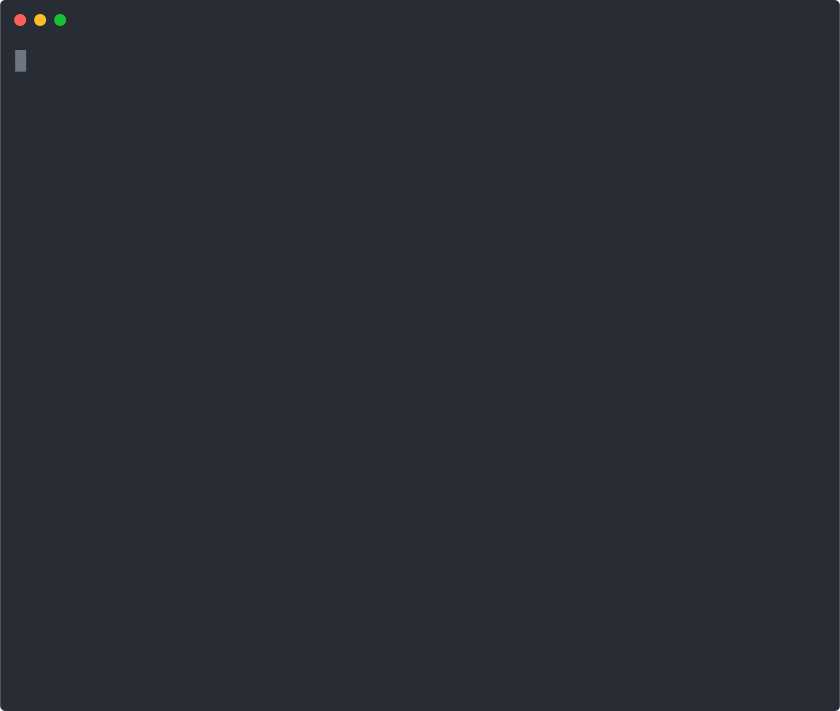

[](https://github.com/ninjra/tidewatch/actions/workflows/ci.yml)


# Tidewatch

**Scores obligations by deadline pressure, dependencies, and what actually matters — so agents know what to work on next.**

<p align="center">
  
</p>

## Why Tidewatch?

- **Not just overdue/not-overdue** — continuous pressure scoring sees urgency accumulating days before a deadline, not just the moment it passes
- **Knows what matters** — a legal brief blocking 50 tasks ranks above a routine config update due the same day. EDF can't make that distinction
- **Shows its work** — deferred scalarization preserves all six scoring factors for inspection. Every ranking decision is auditable and decomposable
- **Scales to tens of thousands** — adaptive rate constant, rank normalization, and zone capacity keep scores discriminating at N > 10,000
- **659 tests, zero dependencies** — verified to Delta < 10^-10 against closed-form reference values. Pure Python 3.11+ stdlib

## Quick Start

```bash
pip install tidewatch
```

```python
from datetime import datetime, timezone, timedelta
from tidewatch import Obligation, recalculate_batch

now = datetime.now(timezone.utc)
obligations = [
    Obligation(id=1, title="File Q1 taxes",
               due_date=now + timedelta(days=3),
               materiality="material", dependency_count=2),
    Obligation(id=2, title="Update README",
               due_date=now + timedelta(days=14)),
]

results = recalculate_batch(obligations)
for r in results:
    print(f"{r.obligation_id}: P={r.pressure:.3f} [{r.zone}]")
# 1: P=0.952 [red]
# 2: P=0.193 [green]
```

## How It Works

Six multiplicative factors, all bounded away from zero:

```
P = min(1.0, P_time x M x A x D x T_amp x V_amp)
```

| Factor | What It Captures | Default |
|--------|-----------------|---------|
| Time decay | Urgency acceleration as deadline approaches | k = 3.0 |
| Materiality | Relative importance weighting | 1.5x for material |
| Dependency fanout | Downstream impact of delays (temporally gated) | k_f = 2.0 |
| Completion dampening | Reduced pressure as work completes | logistic, beta = 0.6 |
| Timing sensitivity | Escalation for stagnant tasks | logistic ramp |
| Violation amplification | Penalty for missed deadlines (14-day half-life decay) | cap = 1.5x |

All constants are sensible defaults tuned for human-scale workflows (days/weeks). Zone thresholds are environment-configurable (`TIDEWATCH_ZONE_*`). The adaptive rate constant (`deadline_distribution` parameter) auto-tunes for any population scale. See `tidewatch/constants.py` for the full parameter set with derivations.

Factors are retained in a six-dimensional component space with **deferred scalarization** — the product collapse happens only when a consumer requests a scalar. Until then, all six dimensions are available for Pareto comparison, weighted aggregation, or per-factor inspection.

**Why multiplicative, not additive?** Weighted-sum aggregation allows a high score on one dimension (e.g., materiality) to compensate for low urgency — a material task due in 30 days could outrank a routine task due tomorrow. In Monte Carlo evaluation, the weighted-sum baseline produces 73% more missed deadlines than product collapse. The multiplicative architecture is a structural necessity, not an arbitrary choice.

## Evaluation

Monte Carlo scheduling simulation (200 trials, seed=42, LogNormal durations):

| Strategy | N=50 Missed | N=200 Missed | Inversions |
|----------|------------|-------------|------------|
| **Tidewatch** | **6.7%** | **20.1%** | **1.9%** |
| EDF | 6.7% | 18.5% | 6.5% |
| Weighted-EDF | 6.7% | 18.6% | 6.4% |
| TOPSIS | 9.3% | 32.8% | 24.6% |
| FIFO | 12.7% | 31.9% | 48.2% |
| Random | 13.0% | 31.2% | 48.5% |

EDF is theoretically optimal for deadline minimization — Tidewatch does not compete on that metric. The 8.6% relative cost at N=200 is the price of encoding materiality, dependency structure, and completion state alongside deadline proximity. Against naive baselines, Tidewatch reduces missed deadlines by 35-47%.

**Why pay 8.6%?** EDF treats all obligations equally. Tidewatch can distinguish a legal brief blocking 50 tasks from a routine config update due the same day. The cost is fewer deadlines met; the return is that the *right* deadlines are met. A value-weighted completion metric (weighting missed deadlines by materiality and downstream impact) would quantify this benefit — this is planned future work.

## Architecture

```
Obligations --> Scorer (6 factors) --> ComponentSpace --> Collapse/Pareto --> Ranked Queue
                                                              |
                                              Bandwidth Modulator (3-tier risk)
```

**Capacity-aware reranking** adjusts presentation order by operator or system load without changing pressure scores. Three risk tiers control which obligations can be demoted. This mechanism is specified and implemented but not empirically validated.

## Scalability

Single-core, pure Python, zero dependencies:

| N | Time | Throughput | Memory |
|---|------|-----------|--------|
| 10,000 | 0.08s | 118K/sec | 52MB |
| 100,000 | 0.90s | 111K/sec | 203MB |
| 1,000,000 | 14s | 71K/sec | 1.7GB |
| 5,000,000 | 74s | 68K/sec | 8.2GB |

A Fortune 500 JIRA instance (~500K issues) scores in under 5 seconds. Incremental rescoring (`recalculate_stale`) touches only changed items — the effective cost is O(k) where k << N.

## Integrations

Tidewatch is a scoring engine, not a product. It sits between your data source and your dispatch system:

```
[JIRA / ServiceNow / GitHub Issues / PagerDuty / Custom DB]
                        ↓
              Tidewatch scoring engine
                        ↓
        [Agent dispatcher / Dashboard / Alert router]
```

See `examples/` for ready-to-use integrations:
- **[quickstart.py](examples/quickstart.py)** — 10-line introduction
- **[jira_integration.py](examples/jira_integration.py)** — map JIRA issues to obligations
- **[api_server.py](examples/api_server.py)** — REST scoring API (stdlib, zero deps)

## Commercial Use

Tidewatch is dual-licensed: **Apache-2.0** for open use, **Commercial** for embedding in proprietary products. See [COMMERCIAL.md](COMMERCIAL.md) for details.

## Part of the Sentinel Constellation

Tidewatch is the prioritization substrate in a family of tools for agent orchestration:

- **Sentinel** — orchestration kernel, session management, obligation tracking
- **Gravitas** — physics-inspired memory retrieval and context assembly
- **Minds-Eye** — repo introspection, coherence analysis, red-team scanning
- **Forge** — prompt evolution engine

## Paper

> **Tidewatch: Multi-Factor Obligation Pressure with Deferred Scalarization**
> Shri Narayan Justin Ram, Infoil LLC (2026)

```bibtex
@article{ram2026tidewatch,
  title={Tidewatch: Multi-Factor Obligation Pressure with Deferred Scalarization},
  author={Ram, Shri Narayan Justin},
  year={2026},
  url={https://github.com/ninjra/tidewatch}
}
```

## Contributing

See [CONTRIBUTING.md](CONTRIBUTING.md). Issues and PRs welcome.

## License

Apache-2.0 OR Commercial — see [LICENSE](LICENSE).
